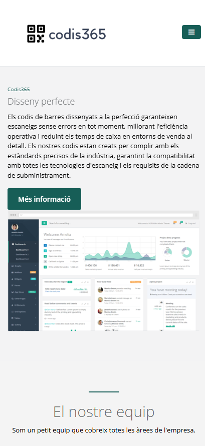
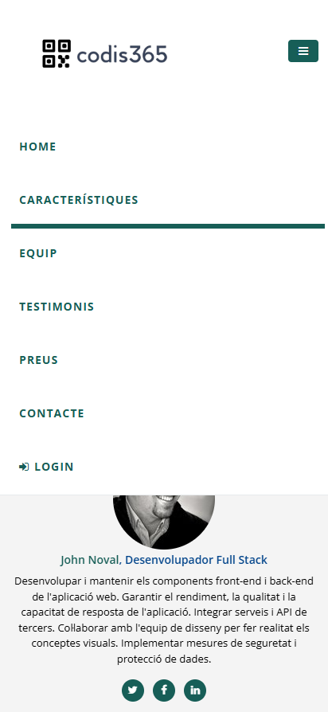
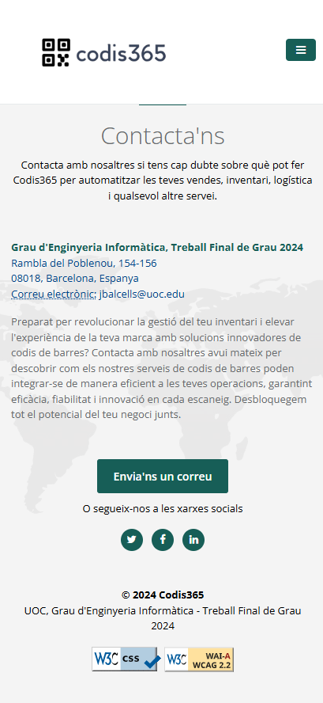

<!-- PROJECT LOGO -->
 

  
  <h3 align="center">README.MD</h3>

  

    Aquest repositori conté el codi font de la pàgina d'aterratge del projecte Codis365, accessible des de qualsevol dels enllaços següents https://app.codis365.es, https://www.codis365.es o https://codis365.es
     
  

<!-- TABLE OF CONTENTS -->

  
Taula de continguts

  <ol>
    <li><a href="#description">Descripció</a></li>
    <li><a href="#accessibility">Consideracions d'accessibilitat</a></li>
    <li><a href="#screenshots">Captures de pantalla</a></li>
  </ol>

<!-- DESCRIPTION -->
## Descripció

Aquesta pàgina és una pàgina web independent creada específicament per a una campanya de màrqueting o publicitat. És on aterra un visitant després de fer clic en un enllaç en un correu electrònic, anuncis de Google, Bing, YouTube, Facebook, Instagram, Twitter o llocs similars a la web. A diferència de les pàgines web, que solen tenir molts objectius i fomentar l'exploració, les pàgines d'aterratge estan dissenyades amb un únic focus o objectiu, conegut com a crida a l'acció (CTA). Aquest enfocament fa que les pàgines d'aterratge siguin la millor opció per augmentar les taxes de conversió de les teves campanyes de màrqueting i reduir el teu cost d'adquirir un lead o venda. 

>👉 CODIS365 ofereix un complet conjunt de solucions de codi de barres destinades a transformar els negocis a través de la creació avançada i personalitzable de codis de barres, proves i validació en temps real, i funcions de gestió a granel. Aprofita la realitat augmentada per a les vistes prèvies de col·locació de codis de barres i ofereix més de 40 simbologies úniques de codis de barres. La plataforma està dissenyada per millorar la gestió de l'inventari, oferint funcions com gràfics dinàmics per al seguiment del rendiment, integració perfecta de l'API i suport avançat per a la gestió eficient de l'inventari i la presa de decisions basada en dades. Les opcions de preus s'adapten a les diferents necessitats de les empreses, des de serveis bàsics fins a serveis premium.

>⚠️Totes les dades esmentades en aquesta pàgina d'aterratge són fictícies i representen un mitjà simulat d'accés al backend o sistema de gestió de Codis365, ja sigui mitjançant l'opció "Login" per a la identificació d'un usuari existent, o a través de "SignUp" per a la creació d'un nou usuari.

<!-- ACCESSIBILITY -->
## Consideracions d'accessibilitat

Aquest projecte compleix amb tots els estàndards d'accessibilitat de les WCAG 2.0 i s'ha verificat a través d'eines del W3C (World Wide Web Consortium) com ara "W3C CSS Validation Service" o "Web Content Accessibility Guidelines (WCAG) 2.2 Level AA Conformance".

    

        
    

     
    

        
    

    

        
    

<!-- SCREENSHOTS -->
## Captures de pantalla

A continuació es mostren algunes captures de pantalla de la pàgina d'aterratge, tant en la versió d'escriptori com en la versió mòbil.

    

        
    

     
    

        
    

     
    

        
    

     
    

        
    

     
    

        
    

     
    

        
    

     
    

        
    

